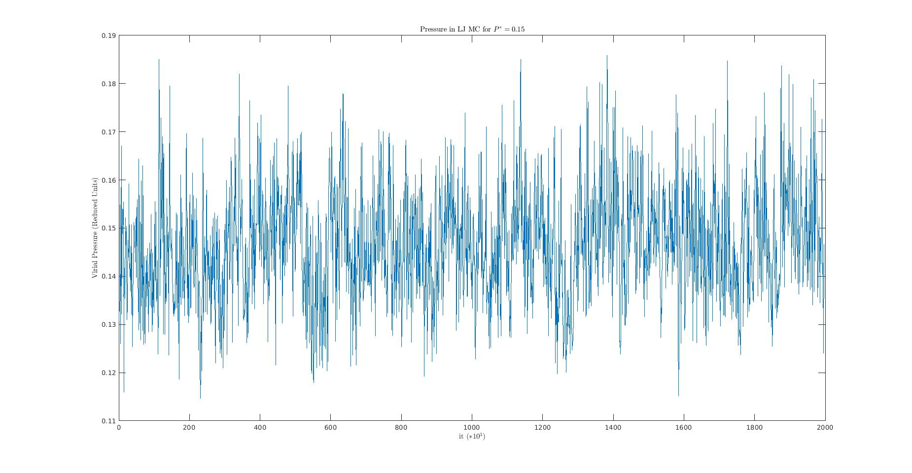

# Monte-Carlo-Simulation-of-a-NPT-Lennard-Jones-system
A Monte Carlo (MC) code for (N,P,T) simulations of Lennard-Jones (LJ) systems has been created as a final project for the Simulation of Condensed Matter course.  
The characteristics of the simulation are presented in the leap-lj.data file which is in the "Code" folder. As well as all the codes for the different pressures. Inside the "Data" folder is where all the results obtained by the simulation are located.
A series of MC simulations at T∗ = 2.0 and pressures from P∗ = 0.15 to P∗ = 15 have been carried out.  
The data extracted from the simulation was used to calculate thermodynamical properties such as: the Energy per atom, the Virial pressure and the radial distribution function.  

